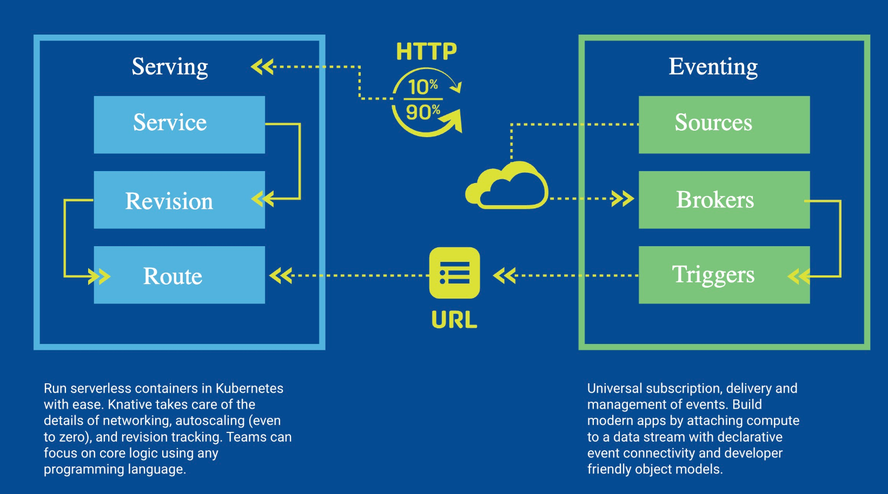
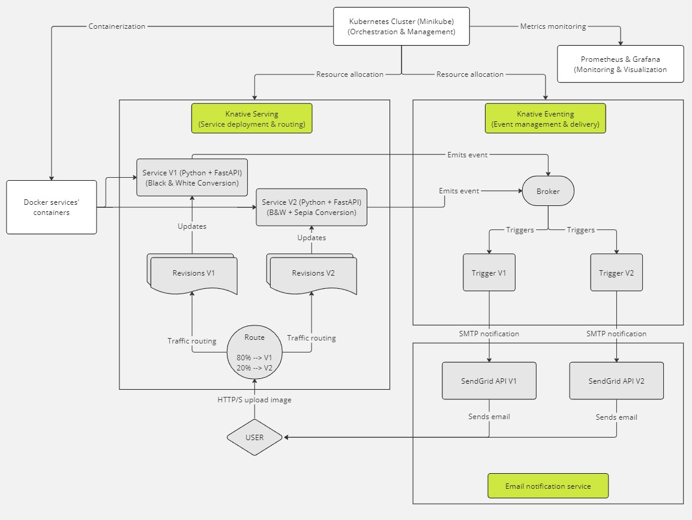

# Knative

## Wprowadzenie

Knative to niezależne od platformy rozwiązanie stworzone z myślą o budowaniu, wdrażaniu i zarządzaniu skalowalnymi aplikacjami w kontenerach,
które są uruchamiane na infrastrukturze Kubernetes. Celem Knative jest ułatwienie i automatyzacja wielu aspektów zarządzania kontenerami, takich jak wdrażanie aplikacji,
zarządzanie ruchem sieciowym oraz łączenie usług. Knative zaprojektowano z myślą o rozszerzalności i integracji z istniejącymi narzędziami i usługami w ekosystemie Kubernetes.
Dzięki temu deweloperzy mogą skoncentrować się na pisaniu kodu aplikacji, nie martwiąc się o infrastrukturę,
co przyspiesza proces wdrażania aplikacji i ułatwia zarządzanie ich cyklem życia.

### Autorzy:
* Dawid Kurdyła
* Michał Świstowski
* Kinga Ramęda
* Piotr Ryczek

## Podstawy teoretyczne i stos technologiczny

Knative opiera się na 3 głównych filarach:
* **Budowa (Build)** \
Knative oferuje narzędzia do automatycznego budowania obrazów kontenerów bezpośrednio z kodu źródłowego przechowywanego w repozytorium git.

* **Obsługa serwerów (Serving)** \
Kluczowe zasoby Knative Serving obejmują Usługi (Services), Trasy (Routes), Konfiguracje (Configurations) oraz Rewizje (Revisions). Usługa w Knative automatycznie zarządza całym cyklem życia obciążenia pracy, kontrolując tworzenie innych obiektów.
Trasy umożliwiają mapowanie punktów końcowych sieci do jednej lub więcej rewizji, pozwalając zarządzać ruchem na wiele sposobów. Konfiguracje utrzymują pożądany stan wdrożenia, oddzielając kod od konfiguracji i umożliwiając tworzenie nowych rewizji przez modyfikację konfiguracji. Rewizje są niezmiennymi migawkami kodu i konfiguracji dla każdej modyfikacji obciążenia pracy, które mogą być automatycznie skalowane w zależności od ruchu przychodzącego.

* **Zdarzenia (Eventing)** \
Knative wprowadza również mechanizm do obsługi zdarzeń, który umożliwia tworzenie aplikacji zorientowanych na zdarzenia i łączenie komponentów aplikacji za pomocą zdarzeń. Ułatwia to tworzenie złożonych aplikacji, które mogą reagować na zdarzenia z różnych źródeł, takich jak wiadomości z kolejek, aktualizacje w bazach danych czy zdarzenia z zewnętrznych API.

### Stos technologiczny:
* Kubernetes - środowisko uruchomieniowe dla Knative. Zapewnia orkierstrację kontenerów, zarządzanie zasobami i skalowalność.
* Knative:
  * Serving - służący do wdrażania i zarządzania serwisami, umożliwa łatwe skalowanie i routing ruchu.
  * Eventing - służący do obsługi zdarzeń w aplikacji.
* Python:
  * FastAPI - framework przydatny do tworzenia prostych aplikacji webowych.
  * Pillow - biblioteka do przetwarzania obrazów.
* Docker - służący do konteneryzacji aplikacji, ułatwiający wdrażanie w Knative i Kubernetes.
* Prometheus i Grafana - służące do monitorowania metryk aplikacji.
* SendGrid - pomocny w mechaniźmie wysyłania e-maili.

## Studium Problemu

Studium problemu skupia się wokół demonstracji możliwości, jakie okferuje Knative, takich jak rozdział ruchu sieciowego, automatyzacja procesów oraz skalowalność aplikacji.

### Problem:
W dynamicznie rozwijającym się świecie cyfrowych mediów, przedsiębiorstwa stają przed wyzwaniem efektywnego i skalowalnego przetwarzania obrazów. Zmieniające się wymagania dotyczące formatów i przetwarzania danych, takich jak konwersja do obrazów czarno-białych, tonacji sepii, a także dostosowanie różnych stopni kompresji, wymagają elastycznego podejścia do zarządzania zasobami. Kluczowe jest znalezienie rozwiązania, które potrafi dynamicznie dostosować się do wahających się ilości przesyłanych danych oraz obciążenia systemu, minimalizując jednocześnie koszty operacyjne.

### Przegląd rozwiązania
Rozwiązanie bazujące na platformie Knative zapewnia elastyczność oraz skalowalność niezbędną do efektywnego przetwarzania i zarządzania obrazami w środowisku cyfrowym. Knative oferuje kluczowe funkcje takie jak automatyczne skalowanie serwisów i zarządzanie ruchem sieciowym, co pozwala na dynamiczną adaptację do zmieniających się warunków operacyjnych.

#### Architektura serwisów:

W ramach projektu wdrożone zostaną dwa serwisy przetwarzające obrazy:

 1. Serwis Konwersji Monochromatycznej (S1) – stara wersja aplikacji, która kontynuuje przetwarzanie obrazów do czarno-białych wersji.
 2. Serwis Rozszerzonej Konwersji i Archiwizacji (S2) – nowa wersja aplikacji, która nie tylko konwertuje obrazy do czarno-białych i sepii, ale również tworzy kompleksowe archiwa ZIP.

#### Traffic Splitting:

Wykorzystując funkcjonalność traffic splitting w Knative, firma może stopniowo przenosić ruch użytkowników z serwisu S1 na bardziej rozbudowany serwis S2. Początkowo, tylko 20% ruchu sieciowego może być przekierowane na S2, pozwalając użytkownikom stopniowo przyzwyczajać się do nowej wersji, jednocześnie monitorując stabilność i wydajność nowego serwisu. Z czasem rozdział ruchu sieciowego może się elastycznie zwiększać na rzecz serwisu S2 w zależności od potrzeb klienta.

#### Knative Eventing:

Knative Eventing pozwala na automatyzację procesów powiązanych z zakończeniem przetwarzania obrazów, takich jak wysyłanie powiadomień e-mail. Dzięki temu użytkownicy są na bieżąco informowani o statusie przetworzonych danych, co stanowi zwiększenie wydajności korzystania z dostępnych serwisów.

