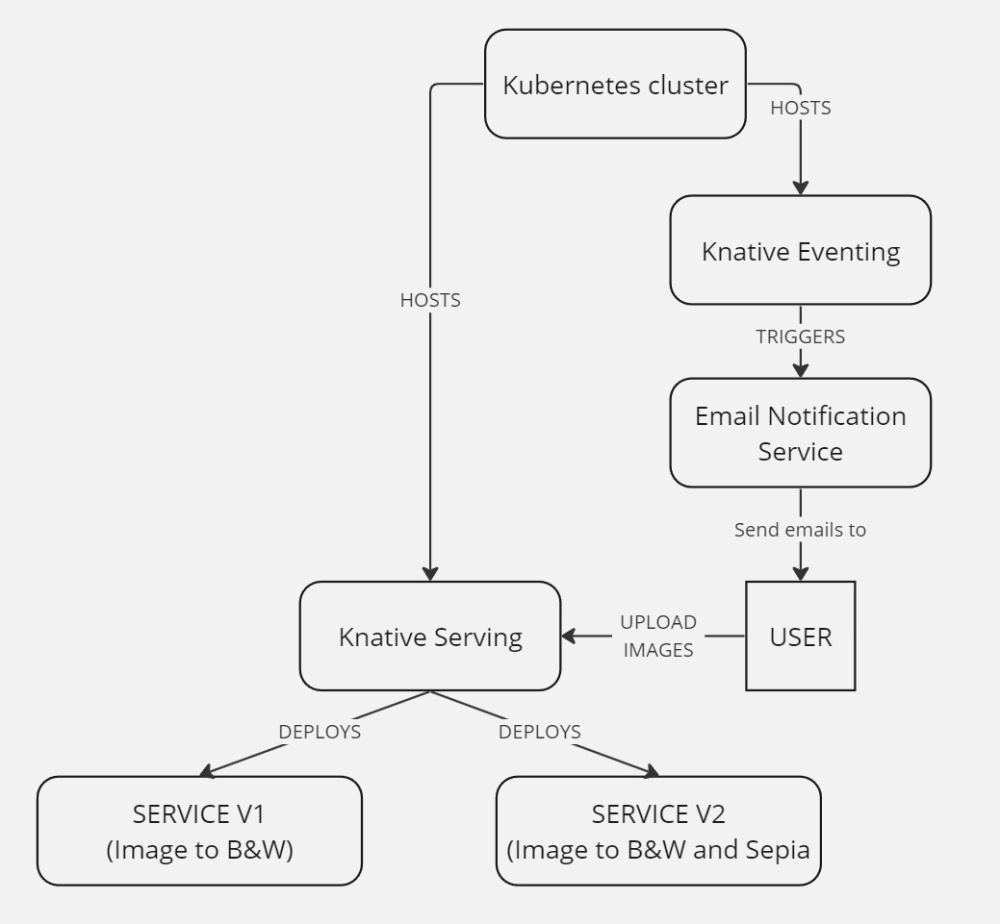

# Knative

## Wprowadzenie

Knative to niezależne od platformy rozwiązanie stworzone z myślą o budowaniu, wdrażaniu i zarządzaniu skalowalnymi aplikacjami w kontenerach,
które są uruchamiane na infrastrukturze Kubernetes. Celem Knative jest ułatwienie i automatyzacja wielu aspektów zarządzania kontenerami, takich jak wdrażanie aplikacji,
zarządzanie ruchem sieciowym oraz łączenie usług. Knative zaprojektowano z myślą o rozszerzalności i integracji z istniejącymi narzędziami i usługami w ekosystemie Kubernetes.
Dzięki temu deweloperzy mogą skoncentrować się na pisaniu kodu aplikacji, nie martwiąc się o infrastrukturę,
co przyspiesza proces wdrażania aplikacji i ułatwia zarządzanie ich cyklem życia.

### Autorzy:
* Dawid Kurdyła
* Michał Świstowski
* Kinga Ramęda
* Piotr Ryczek

## Podstawy teoretyczne i stos technologiczny

Knative opiera się na 3 głównych filarach:
* **Budowa (Build)** \
Knative oferuje narzędzia do automatycznego budowania obrazów kontenerów bezpośrednio z kodu źródłowego przechowywanego w repozytorium git.

* **Obsługa serwerów (Serving)** \
Kluczowe zasoby Knative Serving obejmują Usługi (Services), Trasy (Routes), Konfiguracje (Configurations) oraz Rewizje (Revisions). Usługa w Knative automatycznie zarządza całym cyklem życia obciążenia pracy, kontrolując tworzenie innych obiektów.
Trasy umożliwiają mapowanie punktów końcowych sieci do jednej lub więcej rewizji, pozwalając zarządzać ruchem na wiele sposobów. Konfiguracje utrzymują pożądany stan wdrożenia, oddzielając kod od konfiguracji i umożliwiając tworzenie nowych rewizji przez modyfikację konfiguracji. Rewizje są niezmiennymi migawkami kodu i konfiguracji dla każdej modyfikacji obciążenia pracy, które mogą być automatycznie skalowane w zależności od ruchu przychodzącego.

* **Zdarzenia (Eventing)** \
Knative wprowadza również mechanizm do obsługi zdarzeń, który umożliwia tworzenie aplikacji zorientowanych na zdarzenia i łączenie komponentów aplikacji za pomocą zdarzeń. Ułatwia to tworzenie złożonych aplikacji, które mogą reagować na zdarzenia z różnych źródeł, takich jak wiadomości z kolejek, aktualizacje w bazach danych czy zdarzenia z zewnętrznych API.

### Stos technologiczny:
* Kubernetes - środowisko uruchomieniowe dla Knative. Zapewnia orkierstrację kontenerów, zarządzanie zasobami i skalowalność.
* Knative:
  * Serving - służący do wdrażania i zarządzania serwisami, umożliwa łatwe skalowanie i routing ruchu.
  * Eventing - służący do obsługi zdarzeń w aplikacji.
* Python:
  * FastAPI - framework przydatny do tworzenia prostych aplikacji webowych.
  * Pillow - biblioteka do przetwarzania obrazów.
* Docker - służący do konteneryzacji aplikacji, ułatwiający wdrażanie w Knative i Kubernetes.
* Prometheus i Grafana - służące do monitorowania metryk aplikacji.
* SendGrid - pomocny w mechaniźmie wysyłania e-maili.

## Studium Problemu

### Problem:
W firmie XYZ, zajmującej się fotografią i mediami cyfrowymi, istnieje potrzeba efektywnego przetwarzania wysyłanych przez użytkowników obrazów.
Różnorodność wymagań co do formatów przetwarzania (np. czarno-białe, sepii, kompresji) oraz wahania w ilości przesyłanych danych wymagają rozwiązania,
które jest skalowalne i może dynamicznie dostosowywać się do bieżących potrzeb, zarówno pod względem mocy obliczeniowej, jak i funkcjonalności.

### Przegląd rozwiązania
Wykorzystanie platformy Knative umożliwia firmie XYZ dynamiczne zarządzanie serwisami przetwarzającymi obrazy. System składa się z dwóch głównych serwisów: Serwisu v1,
przekształcającego obrazy do czarno-białych wersji, oraz Serwisu v2, który dodatkowo tworzy archiwa ZIP zawierające zarówno oryginał, czarno-białą wersję, jak i obrazy w sepii.
Knative Serving pozwala na automatyczne skalowanie tych serwisów w odpowiedzi na aktualne obciążenie, zapewniając optymalizację zasobów.
Ponadto, za pomocą Knative Eventing, system może automatycznie wyzwalać proces wysyłania powiadomień email po zakończonym przetwarzaniu, informując użytkowników o gotowości ich zamówień.

