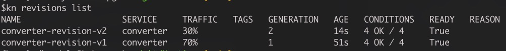
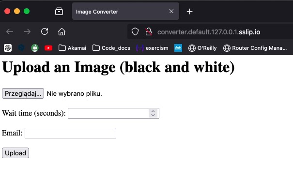
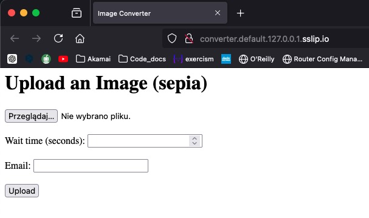
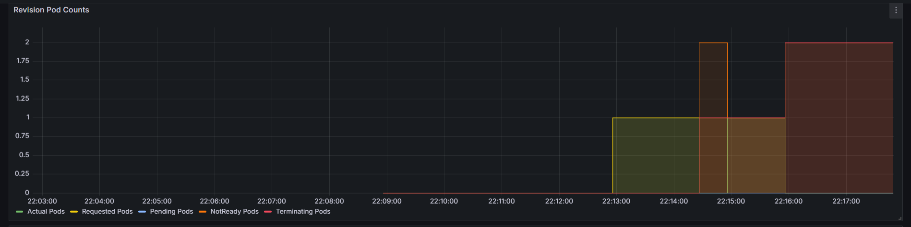
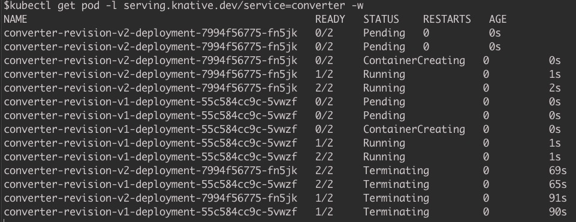
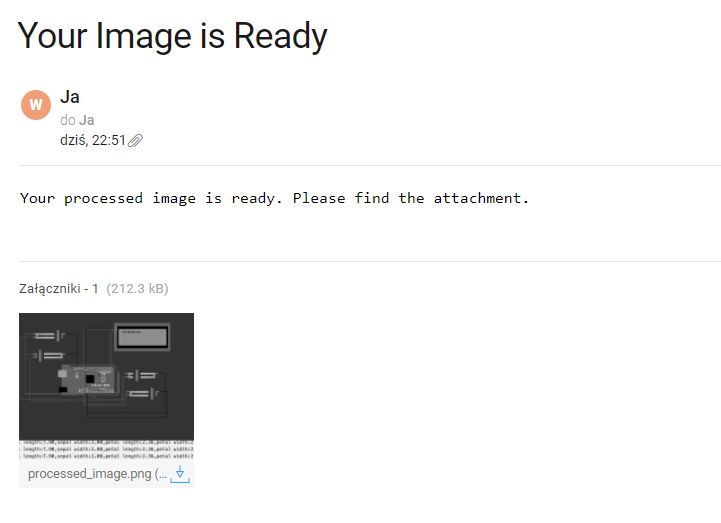

# Knative

## Wprowadzenie

Knative to niezależne od platformy rozwiązanie stworzone z myślą o budowaniu, wdrażaniu i zarządzaniu skalowalnymi aplikacjami w kontenerach,
które są uruchamiane na infrastrukturze Kubernetes. Celem Knative jest ułatwienie i automatyzacja wielu aspektów zarządzania kontenerami, takich jak wdrażanie aplikacji,
zarządzanie ruchem sieciowym oraz łączenie usług. Knative zaprojektowano z myślą o rozszerzalności i integracji z istniejącymi narzędziami i usługami w ekosystemie Kubernetes.
Dzięki temu deweloperzy mogą skoncentrować się na pisaniu kodu aplikacji, nie martwiąc się o infrastrukturę,
co przyspiesza proces wdrażania aplikacji i ułatwia zarządzanie ich cyklem życia.

### Autorzy:
* Dawid Kurdyła
* Michał Świstowski
* Kinga Ramęda
* Piotr Ryczek


## Podstawy teoretyczne i stos technologiczny

Knative opiera się na 3 głównych filarach:
* **Budowa (Build)** \
Knative oferuje narzędzia do automatycznego budowania obrazów kontenerów bezpośrednio z kodu źródłowego przechowywanego w repozytorium git.

* **Obsługa serwerów (Serving)** \
Kluczowe zasoby Knative Serving obejmują Usługi (Services), Trasy (Routes), Konfiguracje (Configurations) oraz Rewizje (Revisions). Usługa w Knative automatycznie zarządza całym cyklem życia obciążenia pracy, kontrolując tworzenie innych obiektów.
Trasy umożliwiają mapowanie punktów końcowych sieci do jednej lub więcej rewizji, pozwalając zarządzać ruchem na wiele sposobów. Konfiguracje utrzymują pożądany stan wdrożenia, oddzielając kod od konfiguracji i umożliwiając tworzenie nowych rewizji przez modyfikację konfiguracji. Rewizje są niezmiennymi migawkami kodu i konfiguracji dla każdej modyfikacji obciążenia pracy, które mogą być automatycznie skalowane w zależności od ruchu przychodzącego.

* **Zdarzenia (Eventing)** \
Knative wprowadza również mechanizm do obsługi zdarzeń, który umożliwia tworzenie aplikacji zorientowanych na zdarzenia i łączenie komponentów aplikacji za pomocą zdarzeń. Ułatwia to tworzenie złożonych aplikacji, które mogą reagować na zdarzenia z różnych źródeł, takich jak wiadomości z kolejek, aktualizacje w bazach danych czy zdarzenia z zewnętrznych API.


### Stos technologiczny:
* Kubernetes - środowisko uruchomieniowe dla Knative. Zapewnia orkierstrację kontenerów, zarządzanie zasobami i skalowalność.
* Knative:
  * Serving - służący do wdrażania i zarządzania serwisami, umożliwa łatwe skalowanie i routing ruchu.
  * Eventing - służący do obsługi zdarzeń w aplikacji.
* Python:
  * FastAPI - framework przydatny do tworzenia prostych aplikacji webowych.
  * Pillow - biblioteka do przetwarzania obrazów.
* Docker - służący do konteneryzacji aplikacji, ułatwiający wdrażanie w Knative i Kubernetes.
* Prometheus i Grafana - służące do monitorowania metryk aplikacji.

## Studium Problemu

Studium problemu skupia się wokół demonstracji możliwości, jakie okferuje Knative, takich jak rozdział ruchu sieciowego, automatyzacja procesów oraz skalowalność aplikacji.

### Problem:
W dynamicznie rozwijającym się świecie cyfrowych mediów, przedsiębiorstwa stają przed wyzwaniem efektywnego i skalowalnego przetwarzania obrazów. Zmieniające się wymagania dotyczące formatów i przetwarzania danych, takich jak konwersja do obrazów czarno-białych, tonacji sepii, a także dostosowanie różnych stopni kompresji, wymagają elastycznego podejścia do zarządzania zasobami. Kluczowe jest znalezienie rozwiązania, które potrafi dynamicznie dostosować się do wahających się ilości przesyłanych danych oraz obciążenia systemu, minimalizując jednocześnie koszty operacyjne.

### Przegląd rozwiązania
Rozwiązanie bazujące na platformie Knative zapewnia elastyczność oraz skalowalność niezbędną do efektywnego przetwarzania i zarządzania obrazami w środowisku cyfrowym. Knative oferuje kluczowe funkcje takie jak automatyczne skalowanie serwisów i zarządzanie ruchem sieciowym, co pozwala na dynamiczną adaptację do zmieniających się warunków operacyjnych.

#### Architektura serwisów:

W ramach projektu wdrożone zostaną dwa serwisy przetwarzające obrazy:

 1. Serwis Konwersji Monochromatycznej (S1) – stara wersja aplikacji, która kontynuuje przetwarzanie obrazów do czarno-białych wersji.
 2. Serwis Rozszerzonej Konwersji i Archiwizacji (S2) – nowa wersja aplikacji, która nie tylko konwertuje obrazy do czarno-białych i sepii, ale również tworzy kompleksowe archiwa ZIP.

#### Traffic Splitting:

Wykorzystując funkcjonalność traffic splitting w Knative, firma może stopniowo przenosić ruch użytkowników z serwisu S1 na bardziej rozbudowany serwis S2. Początkowo, tylko 20% ruchu sieciowego może być przekierowane na S2, pozwalając użytkownikom stopniowo przyzwyczajać się do nowej wersji, jednocześnie monitorując stabilność i wydajność nowego serwisu. Z czasem rozdział ruchu sieciowego może się elastycznie zwiększać na rzecz serwisu S2 w zależności od potrzeb klienta.

#### Knative Eventing:

Knative Eventing pozwala na automatyzację procesów powiązanych z zakończeniem przetwarzania obrazów, takich jak wysyłanie powiadomień e-mail. Dzięki temu użytkownicy są na bieżąco informowani o statusie przetworzonych danych, co stanowi zwiększenie wydajności korzystania z dostępnych serwisów.


### Opis konfiguracji demo
#### Klaster lokalny:
W celu demonstracji funkcjonalności Knative, postawiony zostanie lokalny kluster kubernetes przy wykorzystaniu technologii Minikube. Takie podejście pozwoli przedstawić możliwości Knative, bez konieczności wykorzystywania usług chmurowych.

#### Implementacja dwóch serwisów jako obrazy Dockerowe w Pythonie:
Serwis Konwersji Monochromatycznej (S1): Istniejący serwis, który będzie odpowiedzialny za przetwarzanie obrazów do czarno-białych wersji.
Serwis Rozszerzonej Konwersji i Archiwizacji (S2): Nowa wersja serwisu, która nie tylko wykonuje konwersję obrazów do czarno-białych i sepii, ale także tworzy kompleksowe archiwa ZIP.

#### Setup środowiska:
- Kubernetes: Zapewni infrastrukturę dla uruchomienia klastra i zarządzania kontenerami.
- Knative Serving: Umożliwi wdrażanie i zarządzanie serwisami oraz routingiem ruchu sieciowego.
- Knative Eventing: Automatyzuje procesy związane z zakończeniem przetwarzania obrazów i wysyła powiadomienia e-mail.
- Python (FastAPI oraz Pillow): Wykorzystany do implementacji logiki biznesowej serwisów przetwarzających obrazy.
- Docker: Konteneryzacja aplikacji, ułatwiająca wdrażanie w środowisku Knative i Kubernetes.
- SendGrid: Wykorzystany do mechanizmu wysyłania e-maili, informujących użytkowników o zakończonym przetwarzaniu obrazów.
  
#### Interakcje pomiędzy komponentami:
Serwisy S1 i S2 będą działać jako niezależne komponenty, przetwarzając obrazy i generując zdarzenia informujące o zakończeniu przetwarzania.
Broker Knative będzie monitorował te zdarzenia a następnie generował trigery w celu wysyłania powiadomień e-mail za pomocą SendGrid.
#### Oczekiwane działanie:
Użytkownik dostarcza wybrany obraz do przetwarzania. Po przetworzeniu obrazu przez serwisy S1 lub S2, broker Knative wygeneruje trigger, który spowoduje wysłanie powiadomienia e-mail za pomocą usługi SendGrid, informując użytkownika o zakończeniu przetwarzania obrazu.

## Opis instalacji

### __Traffic Splitting__
<br>

1. Instalujemy potrzebne zależności, dodajemy do zmiennej środowiskowej PATH
- Docker - https://docs.docker.com/engine/install/
- Kind (Kubernetes in Docker) - https://kind.sigs.k8s.io/docs/user/quick-start
- Kubernetes CLI - https://kubernetes.io/docs/tasks/tools/
- Knative CLI - https://knative.dev/docs/client/install-kn/
- Knative quickstart plugin - https://knative.dev/docs/install/quickstart-install/#install-the-knative-cli

2. Uruchamiamy klaster z zainstalowanym Knative, korzystając z pluginu quickstart
```
kn quickstart kind
```
>Quickstart używa portu 80 i nie uda się go zainstalować, jeśli na tym porcie są powiązane jakiekolwiek inne usługi. Jeśli masz usługę korzystającą z portu 80, musisz ją zatrzymać przed użyciem quickstart.

**Quickstart tworzy klaster kubernetesa automatycznie, nie musimy tworzyć żadnego innego klastra**

3. Weryfikujemy stworzony klaster
```
kind get clusters
```
4. Tworzymy pierwszą rewizję naszej aplikacji korzystając z ``bwconverter.yaml``
```
kubectl apply -f <PATH TO bwconverter.yaml>
```
5. Weryfikujemy naszą rewizję
```
kn revisions list
```
6. Jeśli nasza rewizja posiada status ``READY = True``, dodajemy drugą rewizję z konfiguracją rozdzielania ruchu korzystając z pliku ``sepiaconverter.yaml``
```
kubectl apply -f <PATH TO sepiaconverter.yaml>
```
7. Weryfikujemy ponownie nasze rewizje, powinniśmy zobaczyć coś takiego
```
NAME                   SERVICE    TRAFFIC  TAGS  GENERATION  AGE  CONDITIONS  READY  REASON
converter-revision-v2  converter  30%            2           10m  3 OK / 4    True 
converter-revision-v1  converter  70%            1           36m  3 OK / 4    True
```
8. Jeśli wszystko się udało nasza aplikacja powinna być dostępna pod adresem
```
kn service describe converter -o url
``` 
<br>

### __Prometeus i Grafana__
<br>

1. Instalujemy helm i dodajemy go do zmiennej środowiskowej PATH
https://helm.sh/docs/intro/install/

2. Dodajemy i aktualizujemy repozytorium helm
```
helm repo add prometheus-community https://prometheus-community.github.io/helm-charts
helm repo update
```
3. Instalujemy prometheus wykorzystając plik ``prometheus_chart.yaml``
```
helm install prometheus prometheus-community/prometheus -f <PATH TO prometheus_chart.yaml>
```

4. Stosujemy rozszerzenie ServiceMonitor/PodMonitor aby zbierać metryki z Knative
```
kubectl apply -f https://raw.githubusercontent.com/knative-extensions/monitoring/main/servicemonitor.yaml
```

5. Aby dostać się do dashboardu prometheusa, uruchamiamy port-forward
```
kubectl port-forward -n default svc/prometheus-kube-prometheus-prometheus 9090:9090
```

6. Prometheus powinien być dostępny pod adresem
```
http://localhost:9090
```

7. Aby dostać się do dashboardu grafany, uruchamiamy port-forward
```
kubectl port-forward -n default svc/prometheus-grafana 3000:80
```

8. Grafana powinna być dostępna pod adresem
```
http://localhost:3000
```

9. Logujemy się do grafany używając domyślnych danych
```
username: admin
password: prom-operator
```

10. Importujemy dashboardy dostępne na githubie knative-extensions
```
kubectl apply -f https://raw.githubusercontent.com/knative-extensions/monitoring/main/grafana/dashboards.yaml
```

<br>

### __Knative eventing__
<br>

1. Tworzymy broker który będzie odpowiedzialny za wysyłanie maili korzystając z pliku ``broker.yaml``
```
kubectl apply -f <PATH TO broker.yaml>
```

2. Tworzymy serwis wysyłający maile korzystając z pliku ``mail_service.yaml``
```
kubectl apply -f <PATH TO mail_service.yaml>
```

3. Tworzymy trigger który będzie przyjmował zdarzenia zakończenia przetwarzania obrazów korzystając z pliku ``email_trigger.yaml`` oraz będzie wywoływał serwis wysyłający maile
```
kubectl apply -f <PATH TO email_trigger.yaml>
```

### __Demo__

#### Lista utworzonych rewizji:

Jak można zauważyć, ruch jest dzielony w proporcji 70/30 pomiędzy starym(black and white) i nowym (sepia) serwisem.

#### Traffic splitting


<br>
Rewizja 1
<br>

<br>

Rewizja 2
<br>

<br>

#### Skalowanie 



Wraz z narastaniem ruchu, można zaobserwować tworzenie nowych podów do obsługi zapytań, po ich wykonaniu, pody są zamykane.

#### Eventing

Dzięki mechanizmowi eventów dostarczanego przez Knative, nasz serwis po przeprocesowaniu obrazu wysyła event wskazujący na zakończenie zadania,
co skutkuje wysłaniem do użytkownika maila z informacją o zakończeniu działania oraz z przetworzonym obrazem.